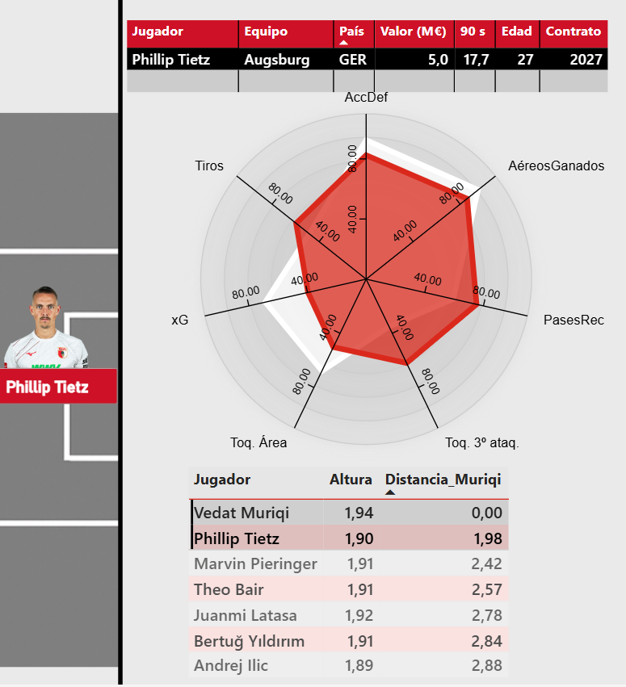

# Data-Driven Scouting: A Player Recommendation System for RCD Mallorca


**Master's Thesis — Big Data Applied to Football Scouting (Universidad Católica de Murcia | Sports Data Campus)**
Author: Miguel Ángel Romero Tornero · Advisor: Pablo Sanzol · 2025

> An end-to-end methodology for translating open football data into actionable transfer recommendations for a top-tier club with a limited budget — built with a Python data pipeline, a custom scoring algorithm, and an interactive Power BI dashboard.

---

## 1. Business Problem

RCD Mallorca, recently stabilized in Spain's top division, needs to strengthen its squad under significant budget constraints compared to wealthier competitors. Mid-sized clubs like this one often lack a systematic way to combine open data with traditional scouting to make transfer decisions with confidence.

**Goal:** build a repeatable system that turns performance data into actionable signing recommendations, reducing both the risk and the opportunity cost of each transfer decision.

**Specific objectives:**
- Analyze the club's playing model and current squad performance (collective and individual).
- Identify priority positions to reinforce and define ideal player profiles for each one.
- Extract, clean, and unify data from multiple open sources into a single analyzable dataset.
- Build a weighted ranking algorithm by position and market criteria.
- Visualize results in an interactive dashboard for the sporting management team.

## 2. Data Sources

| Source | Data provided |
|---|---|
| **FBref** | Shooting, passing, possession, chance creation, defense, miscellaneous stats |
| **Understat** | xG, PPDA / OPPDA (pressing intensity) |
| **Transfermarkt** | Specific position, contract status, market value |
| **Sofascore / BeSoccer** | Heatmaps and contextual match information |

All sources are open-access — no proprietary club data or paid providers (Wyscout, StatsBomb) involved, which keeps the pipeline fully reproducible and shareable.

## 3. Data Pipeline

1. **Extraction**
   - FBref: tables exported and processed in Python.
   - Transfermarkt: automated scraping via the `LanusStats` library.
2. **Cleaning**
   - Name normalization, position standardization, null handling, and cross-source inconsistency fixes.
3. **Entity matching / concatenation**
   - Merged FBref + Transfermarkt using `RapidFuzz` (fuzzy name matching) across ~2,200 players, since the two sources share no common ID.
   - Output: a unified dataset with both performance and market metrics per player.

## 4. Analytical Approach

### 4.1 Collective analysis (RCD Mallorca)
- **Defense:** mid-block press (mid-range PPDA); strong in aerial duels and clearances (league top 2); above-target xG against despite conceding mostly low-quality shots.
- **Attack:** below-average possession (46.8%); limited chance creation (xG for needs improvement); high crossing frequency (2nd in the league); effective long-pass game.

### 4.2 Position-by-position profiles
For each position, **two complementary profiles** were defined (a defensive/positional one and an offensive/vertical one), with specific exceptions for wingers (dribbling/passing vs. finishing) and center-forwards (aerial target vs. versatile forward). Applied to the current squad, for example:

- Center-backs: Raíllo/Valjent (aerial, clearances) vs. Copete (higher risk-taking)
- Right-backs: Morey (defensive) vs. Maffeo (attacking)
- Left-backs: Mojica (highly offensive) vs. Lato (balanced)
- Defensive midfielders: Mascarell (positional) vs. Samú Costa (box-to-box)
- Central midfielders: Morlanes (continuity) vs. Darder (creation)
- Wingers: Robert (dribbling/passing) vs. Asano (vertical/finisher)
- Forwards: Muriqi/Larin (aerial reference)

### 4.3 Filtering system
Before scoring market candidates, viability filters are applied:
- Age (depending on whether the position needs generational renewal or experience)
- Minutes played (>900 min, to ensure a statistically reliable sample)
- Contract status (prioritizes players close to contract expiry → market opportunity)
- Height (relevant for center-backs and forwards)
- Market value (adjusted to positional priority and available budget)

### 4.4 Scoring system
The filtered shortlist is scored (0–100) using a weighted combination of primary and secondary metrics by position, with additional weighting for contextual variables (contract nearing expiry, height by position). The result ranks candidates and produces the final shortlist per profile.

## 5. Results

- Identification of priority positions to reinforce in the squad.
- Defined profile-types (defensive/offensive) for every position.
- Top 7 shortlist per profile, optimized for value-for-money relative to the market.
- Interactive Power BI dashboard to explore and compare candidates by position, profile, and metric.

## 6. Tech Stack

`Python` (pandas, RapidFuzz, LanusStats) · `Power BI` · FBref / Understat / Transfermarkt / Sofascore as data sources

## 7. Demo

[](https://youtu.be/nLq9NIM0Zks)

## 8. Repository Structure

```
.
├── README.md
├── notebooks/
│   └── data_cleaning_and_entity_matching.ipynb   # data extraction, cleaning, and fuzzy matching (FBref + Transfermarkt)
├── dashboard/
│   └── screenshots/                              # 2-3 static views of the Power BI dashboard
└── docs/
    └── executive_summary.pdf                     # optional: condensed summary of the full thesis
```

Only one notebook is included in the repo — the data cleaning and entity-matching pipeline — since it best demonstrates the skills most transferable to a data role outside sports: turning messy, multi-source data into a clean, unified, analysis-ready dataset. The scoring and dashboard logic are documented in this README rather than included as raw code, to keep the repo focused and easy to review.

## 9. Limitations & Future Work

- The model relies on open data only, without access to tracking data or in-person qualitative scouting, which would complement the quantitative analysis.
- Scoring weights are currently defined manually; a natural next step would be to learn weights from historical successful transfers, or explore player-similarity embeddings to widen the search beyond leagues already covered by FBref.
